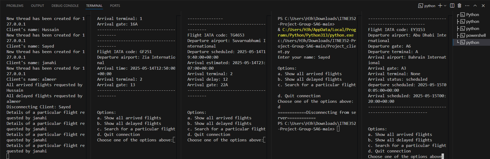

# 🛰️ Flight arrival Information System
**Description:**

This project is a multithreaded client-server system in Python that lets you access the arrival information of flights at the selected     airport. The server is capable of retrieving flight data using an ICAO code with the aviationstack API and storing data on a local file. Furthermore it can handle multiple clients at the same time with the help of threads in Java. Clients can connect to the server and request a list of either arrived or delayed flights or search for a specific one. The system illustrates several important aspects of network program development, such as socket communication, multithreading, API integration, and program structuring. 

#  👥 Group Information 
 ```Second Semester 2024/2025```

 ```Group Name:SA6```

```Course: ITNE352```

 ```Section:01```
        
   ```Name:Sayed Mustafa Ali```               
   ```Student ID:202207690```

   ```Name:Hussain Ali Merza ```                 
   ```Student ID:202207930```
           
 ```Instructor: Dr. Mohamed Abdulaziz Al-Meer```


# 📍 Table of Contents

[Description](#description)

[Group Information](#group-information)

[Requirements](#requirements)

[How to run the system](#how-to-run-the-system)

[Scripts](#scripts)

- Server

- Client

[Acknowledgments](#acknowledgments)

[Conclusion](#conclusion)
# ⚙️ Requirements

- Python 3
- requests
- json
- threading
- socket
- ssl
- visual studio code
- aviationstack API key (for flight data retrieval)
- A valid ICAO airport code
- server certificate and key files (server.crt and server.key) for SSL encryption      

# 🚀 how to run the system

1- Run the server 

 - open the window Cmd
- Go to the directory which includes the program Files 
- Run the server using:

        python Project_server.py
- When prompted, enter a valid ICAO airport code 

2- Run the Client 

- Open another window Cmd
- Go to the directory which includes the program Files 
- Run the client using:

        python Project_client.py

- Enter your name when prompted

3-Interact with the Server by using the menu that will apper to user 

        
        Options:
        a. Show all arrived flights
        b. Show all delayed flights
        c. Search for a particular flight
        d. Quit connection
        
4-After finishing from the program and user diconect from the server close the server 
 
you can usr  ```Ctrl + C``` in the terminal where the server is running and it will close.

# 💻📋 scripts

**1-🚪 server** 

 1.1-Main Functionality:

- Sets up a secure server using SSL.

- Fetches flight data from the AviationStack API.

- Handles multiple clients using threading.

- Responds to specific client queries: show arrived flights, delayed flights, or search for a flight.


 1.2– 📦Server Packages  

```python
import requests
import json
import threading
import socket
import ssl
```
1.3– 🧠Server Functions
- Thread Function
```python
    def Thread(sock_a, id):
    Cname = sock_a.recv(1024).decode('ascii')
    print('Client\'s name: {}'.format(Cname))
    try:
        while True:
            choice = sock_a.recv(1024).decode('ascii')
            # Handle choices: arrived, delayed, search, quit, invalid
            ...
    except (ConnectionResetError, BrokenPipeError):
        print("Client {} disconnected.".format(Cname))
    finally:
        sock_a.close()
```
- SSL context
```python
        ssl_cont = ssl.SSLContext(ssl.PROTOCOL_TLS_SERVER)
        ssl_cont.load_cert_chain(certfile='cert.pem', keyfile='key.pem')
```
- server setup
```python
        with socket.socket(socket.AF_INET,socket.SOCK_STREAM) as ss:
        ss.bind(("127.0.0.1", 1025))
        ss.listen(3)
  
```
2 – 🧑‍💻 Client

 2.1-Main Functionality:
- Connects to the secure server.

- Sends user input and receives formatted flight data.

- Provides a menu for selecting different flight queries.

- Displays the results in a user-friendly format.

 2.2– 📦Client Packages  

```python
import socket
import ssl   
```
2.3– 🧠Client Functions

- Data Receive Function
```python
        def recv_all(sock, buffer=4096):
        data = b''
        while True:
                chunck = sock.recv(buffer)
                data += chunck
                if len(chunck) < buffer:
                break
        return data.decode('ascii')
```
- ssl context creation
```python
        sl_cont = ssl.create_default_context()
        ssl_cont.check_hostname = False
        ssl_cont.verify_mode = ssl.CERT_NONE
```
- Connection and wrapping the socket with ssl
```python
        address = ("127.0.0.1", 1025)
        Cname = input('Enter your name: ')
        with socket.socket(socket.AF_INET, socket.SOCK_STREAM) as cs:
        cs.connect(address)

        #wrapping the socket with ssl
        ssl_sock = ssl_cont.wrap_socket(cs, server_hostname=address[0])
        ssl_sock.sendall(Cname.encode('ascii')) 
```
- Menu Function and taking user input
```python
        while True:
        print("\nOptions:")
        print("a. Show all arrived flights")
        print("b. Show all delayed flights")
        print("c. Search for a particular flight")
        print("d. Quit connection")
       
        choice = input("Choose one of the options above: ").strip()
```
**more than 3 client connect at the same time**

# 🔐 Additional concept: SSL implemntation
Using OpenSSL software we generated both the private key and the certificate

- server SSL implementation:  
```python
#creating the ssl context
ssl_cont = ssl.SSLContext(ssl.PROTOCOL_TLS_SERVER)
ssl_cont.load_cert_chain(certfile='cert.pem', keyfile='key.pem')
```
```python
    while True:
        sock_a,sockname= ss.accept()
        try:
            #wrapping the client socket with SSL
            ssl_conn = ssl_cont.wrap_socket(sock_a, server_side=True)
            t = threading.Thread(target= Thread,args=(ssl_conn,len(my_threads)+1))
```
- client SSL implementation:
```python
#ssl context creation
ssl_cont = ssl.create_default_context()
ssl_cont.check_hostname = False
ssl_cont.verify_mode = ssl.CERT_NONE
```
```python
address = ("127.0.0.1", 1025)
Cname = input('Enter your name: ')
with socket.socket(socket.AF_INET, socket.SOCK_STREAM) as cs:
    cs.connect(address)

    #wrapping the socket with ssl
    ssl_sock = ssl_cont.wrap_socket(cs, server_hostname=address[0])
```
**🦈 Wireshark screenshot capture provided**


# 🙏 Acknowledgments

- Thanks to the instructor ```Dr. Mohamed Abdulaziz Al-Meer``` for support and guidance throughout the project.
- Thanks peers for their collaboration and insights.

# 📝 Conclusion
This project show us how Python can be used with immense capability to create a multithreaded client-server system. Communication is secured with SSL encryption, and the system is integrated AviationStack API for real-time flight data. The system’s user interface and overall navigation within the system is designed to be user-friendly and efficient, thus valuable to users seeking swift access to flight information.

